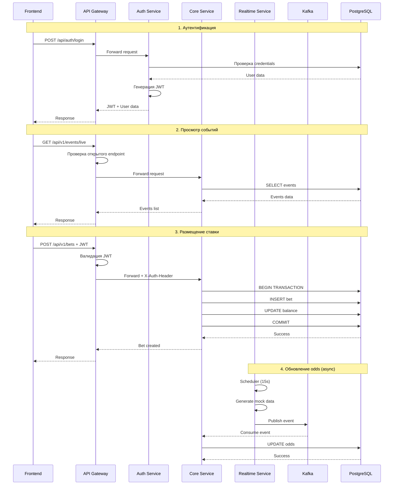
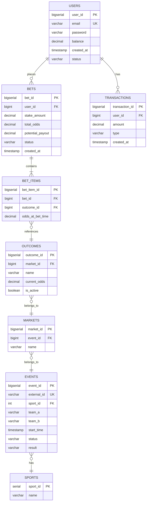
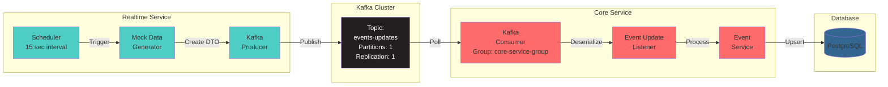
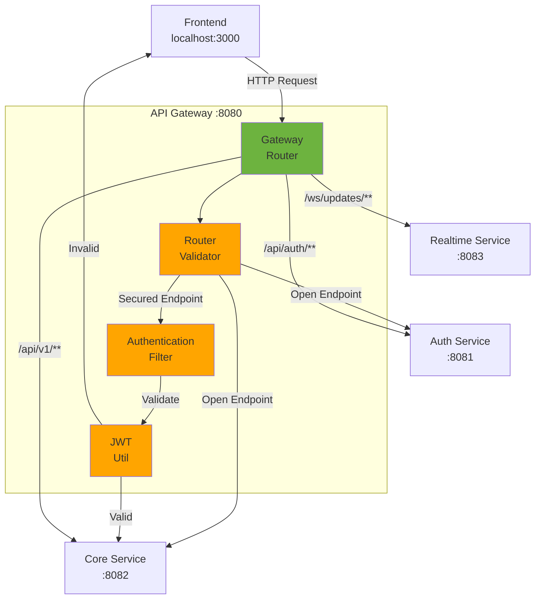
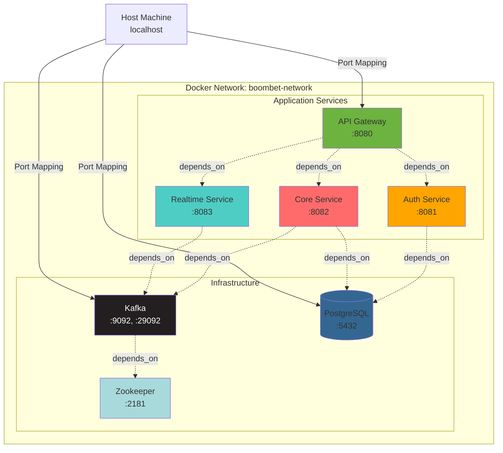
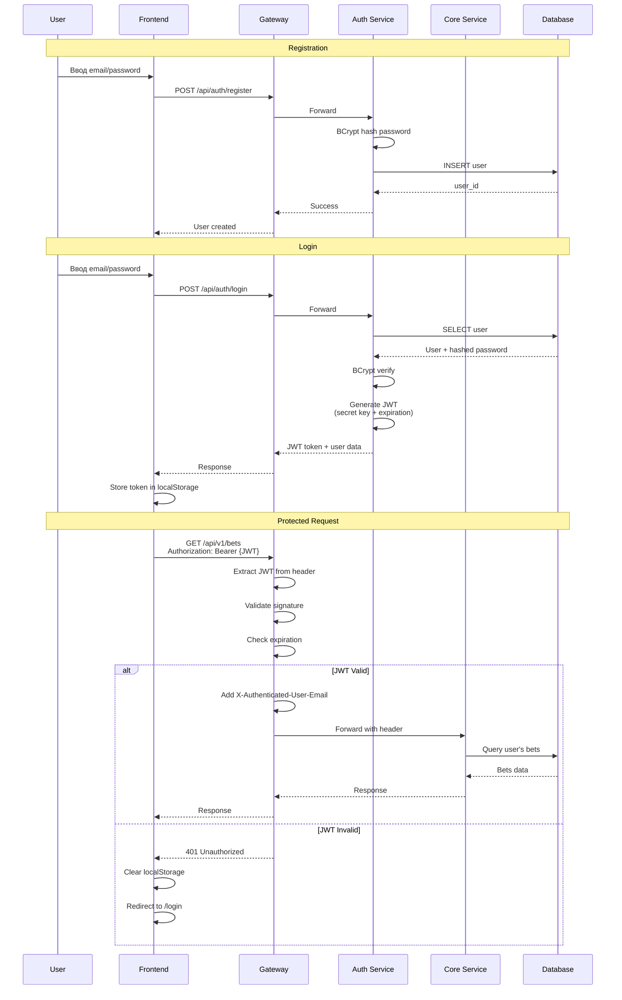
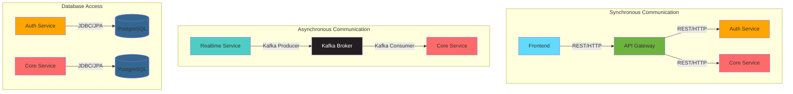

# Диаграммы архитектуры BoomBet

## 1. Общая архитектура системы (High-Level)

```mermaid
graph TB
    subgraph "Client Layer"
        FE[React Frontend<br/>Port 3000]
    end

    subgraph "API Layer"
        GW[API Gateway<br/>Port 8080<br/>Spring Cloud Gateway]
    end

    subgraph "Service Layer"
        AUTH[Auth Service<br/>Port 8081<br/>Аутентификация]
        CORE[Core Service<br/>Port 8082<br/>Бизнес-логика]
        RT[Realtime Service<br/>Port 8083<br/>Генерация данных]
    end

    subgraph "Data Layer"
        DB[(PostgreSQL<br/>Port 5432)]
        KAFKA[Apache Kafka<br/>Port 9092]
        ZK[Zookeeper<br/>Port 2181]
    end

    FE -->|HTTP/REST| GW
    GW -->|HTTP| AUTH
    GW -->|HTTP| CORE
    GW -->|WebSocket| RT

    AUTH -->|JDBC| DB
    CORE -->|JDBC| DB

    RT -->|Producer| KAFKA
    CORE -->|Consumer| KAFKA
    KAFKA -->|Coordination| ZK

    style FE fill:#61dafb
    style GW fill:#6db33f
    style AUTH fill:#ffa500
    style CORE fill:#ff6b6b
    style RT fill:#4ecdc4
    style DB fill:#336791
    style KAFKA fill:#231f20
```

## 2. Детальная схема коммуникации

## 3. Архитектура данных (Database Schema)

## 4. Kafka Event Flow

## 5. API Gateway Routing

## 6. Deployment Architecture (Docker Compose)

## 7. Security Flow (JWT Authentication)

## 8. Microservices Communication Patterns

## Как использовать эти диаграммы

1. **Для презентации**: Скопируйте код Mermaid в онлайн редактор https://mermaid.live/
2. **Для документации**: GitHub и многие IDE (VS Code с расширением) поддерживают Mermaid
3. **Для экспорта**: Из mermaid.live можно экспортировать в PNG/SVG/PDF

## Ключевые точки для защиты

При объяснении архитектуры на защите акцентируй внимание на:

1. **Почему микросервисы, а не монолит?**

   - Независимое масштабирование
   - Изоляция сбоев
   - Гибкость технологий
   - Параллельная разработка

2. **Почему API Gateway?**

   - Единая точка входа
   - Централизованная аутентификация
   - Упрощение клиента
   - Возможность rate limiting

3. **Почему Kafka?**

   - Асинхронность
   - Надежность доставки
   - Масштабируемость
   - Decoupling сервисов

4. **Почему JWT?**

   - Stateless аутентификация
   - Не нужна сессия на сервере
   - Легко масштабируется
   - Содержит claims (user info)

5. **Почему PostgreSQL?**

   - ACID транзакции (критично для ставок)
   - Сложные JOIN'ы
   - Надежность
   - Зрелость технологии

6. **Компромиссы архитектуры:**
   - Сложность vs Гибкость
   - Network latency vs Изоляция
   - Eventual consistency vs Strong consistency
   - Operational overhead vs Масштабируемость
