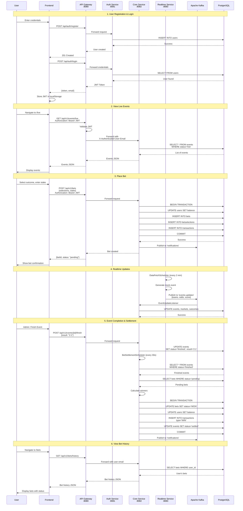
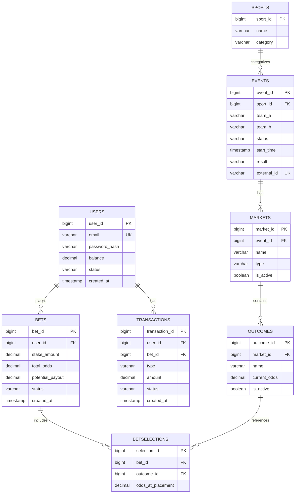
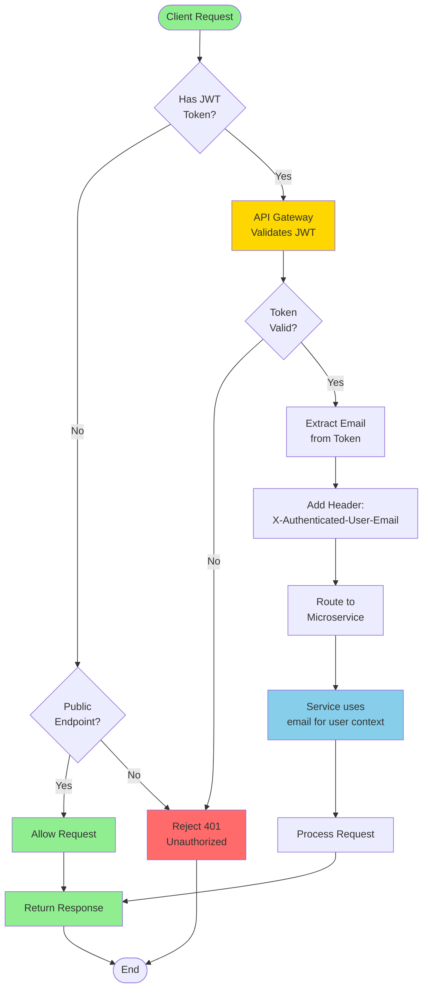
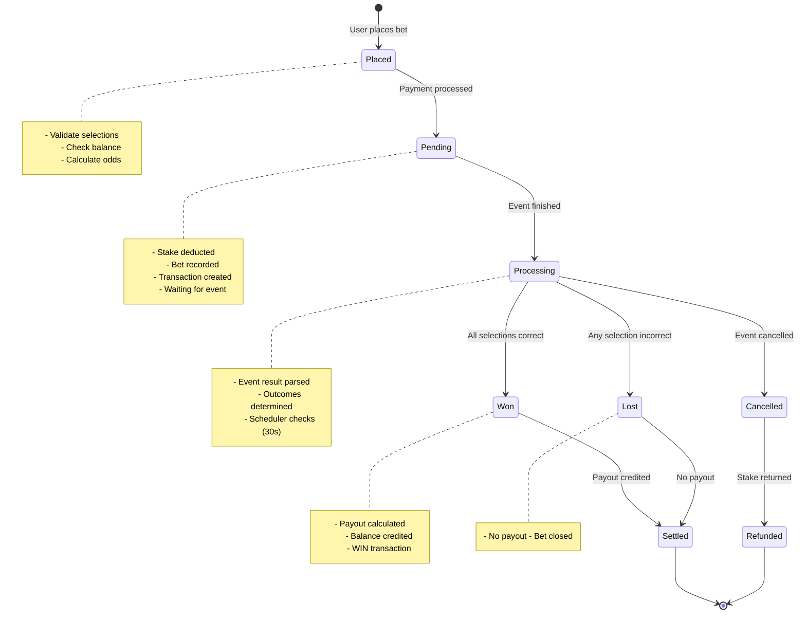

# Схемы архитектуры BoomBet

## 1. Общая схема микросервисов (High-Level)

```mermaid
graph TB
    subgraph "Client Layer"
        FE[React Frontend<br/>:3000]
    end

    subgraph "API Gateway Layer"
        GW[API Gateway<br/>Spring Cloud Gateway<br/>:8080<br/><br/>- JWT Validation<br/>- Routing<br/>- Security]
    end

    subgraph "Microservices Layer"
        AUTH[Auth Service<br/>:8081<br/><br/>- Registration<br/>- Login<br/>- JWT Generation]
        CORE[Core Service<br/>:8082<br/><br/>- Events Management<br/>- Bet Placement<br/>- Bet Settlement<br/>- Balance Management]
        RT[Realtime Service<br/>:8083<br/><br/>- Mock Data Generator<br/>- External API Simulator]
    end

    subgraph "Data Layer"
        DB[(PostgreSQL<br/>:5432<br/><br/>- users<br/>- events<br/>- markets<br/>- outcomes<br/>- bets<br/>- transactions)]
        KAFKA[Apache Kafka<br/>:9092<br/><br/>Topics:<br/>- events-updates<br/>- notifications]
    end

    FE -->|HTTP/REST<br/>JWT Token| GW
    GW -->|/api/auth/**| AUTH
    GW -->|/api/v1/**| CORE
    GW -->|/api/v1/**| RT

    AUTH -->|JDBC| DB
    CORE -->|JDBC| DB
    RT -->|Kafka Producer| KAFKA
    KAFKA -->|Kafka Consumer| CORE

    style FE fill:#61dafb
    style GW fill:#6db33f
    style AUTH fill:#ff9900
    style CORE fill:#ff6600
    style RT fill:#9933ff
    style DB fill:#336791
    style KAFKA fill:#231f20
```

## 2. Детальная схема коммуникации с протоколами

## 3. Схема базы данных

## 4. Схема потока данных (Data Flow)

```mermaid
flowchart LR
    subgraph "External World"
        USER[User Browser]
    end

    subgraph "Frontend"
        UI[React UI]
        STORE[Zustand Store]
        HTTP[Axios HTTP Client]
    end

    subgraph "API Gateway"
        FILTER[Auth Filter]
        ROUTER[Router]
    end

    subgraph "Auth Domain"
        AUTH_CTRL[Auth Controller]
        AUTH_SVC[Auth Service]
        JWT_UTIL[JWT Utility]
    end

    subgraph "Core Domain"
        EVENT_CTRL[Event Controller]
        BET_CTRL[Bet Controller]
        BET_SVC[Bet Service]
        SETTLE_SVC[Settlement Service]
        EVENT_LISTENER[Kafka Listener]
    end

    subgraph "Realtime Domain"
        SCHEDULER[Data Scheduler]
        PARSER[Data Parser]
        KAFKA_PROD[Kafka Producer]
    end

    subgraph "Persistence"
        REPO[JPA Repositories]
        DB[(PostgreSQL)]
    end

    subgraph "Messaging"
        KAFKA_BROKER[Kafka Broker]
    end

    USER --> UI
    UI <--> STORE
    STORE --> HTTP
    HTTP --> FILTER
    FILTER --> ROUTER

    ROUTER --> AUTH_CTRL
    AUTH_CTRL --> AUTH_SVC
    AUTH_SVC --> JWT_UTIL
    AUTH_SVC --> REPO

    ROUTER --> EVENT_CTRL
    ROUTER --> BET_CTRL
    BET_CTRL --> BET_SVC
    EVENT_CTRL --> BET_SVC
    BET_SVC --> SETTLE_SVC
    BET_SVC --> REPO

    SCHEDULER --> PARSER
    PARSER --> KAFKA_PROD
    KAFKA_PROD --> KAFKA_BROKER
    KAFKA_BROKER --> EVENT_LISTENER
    EVENT_LISTENER --> REPO

    REPO --> DB

    style USER fill:#87CEEB
    style UI fill:#61dafb
    style FILTER fill:#ffeb3b
    style AUTH_SVC fill:#ff9900
    style BET_SVC fill:#ff6600
    style SETTLE_SVC fill:#e91e63
    style KAFKA_BROKER fill:#231f20
    style DB fill:#336791
```

## 5. Схема безопасности (Security Flow)

## 6. Схема развертывания (Deployment)

```mermaid
graph TB
    subgraph "Docker Host"
        subgraph "boombet-network"
            GW_C[api-gateway<br/>Container<br/>Port 8080]
            AUTH_C[auth-service<br/>Container<br/>Port 8081]
            CORE_C[core-service<br/>Container<br/>Port 8082]
            RT_C[realtime-service<br/>Container<br/>Port 8083]
            PG_C[postgres<br/>Container<br/>Port 5432]
            ZK_C[zookeeper<br/>Container<br/>Port 2181]
            K_C[kafka<br/>Container<br/>Port 9092]
        end

        PG_VOL[postgres-data<br/>Volume]
    end

    subgraph "Host Machine"
        FE_DEV[Frontend Dev Server<br/>Vite :3000]
    end

    FE_DEV -->|http://localhost:8080| GW_C

    GW_C --> AUTH_C
    GW_C --> CORE_C
    GW_C --> RT_C

    AUTH_C --> PG_C
    CORE_C --> PG_C
    RT_C --> K_C
    K_C --> CORE_C
    K_C --> ZK_C

    PG_C -.->|Persist| PG_VOL

    style GW_C fill:#6db33f
    style AUTH_C fill:#ff9900
    style CORE_C fill:#ff6600
    style RT_C fill:#9933ff
    style PG_C fill:#336791
    style K_C fill:#231f20
    style ZK_C fill:#666
    style FE_DEV fill:#61dafb
    style PG_VOL fill:#ffd700
```

## 7. Схема жизненного цикла ставки

## 8. Схема планировщиков (Schedulers)

```mermaid
gantt
    title Scheduled Tasks Timeline
    dateFormat ss
    axisFormat %S sec

    section Realtime Service
    Generate Mock Data (120s) :active, rt1, 00, 120s
    Publish to Kafka :milestone, rt2, 120, 0s
    Generate Mock Data :rt3, 120, 120s

    section Core Service
    Event Status Check (30s) :active, es1, 00, 30s
    Event Status Check :es2, 30, 30s
    Event Status Check :es3, 60, 30s
    Event Status Check :es4, 90, 30s

    section Core Service
    Bet Settlement (30s) :active, bs1, 00, 30s
    Bet Settlement :bs2, 30, 30s
    Bet Settlement :bs3, 60, 30s
    Bet Settlement :bs4, 90, 30s

    section Kafka Consumer
    Listen for events :active, kc1, 00, 120s
```

---

## Как использовать эти схемы:

### Для презентации:

1. **Общая схема (#1)** - показывает всю архитектуру на одном слайде
2. **Схема коммуникации (#2)** - объясняет пошаговое взаимодействие
3. **База данных (#3)** - показывает структуру данных

### Для объяснения:

- **Data Flow (#4)** - для вопросов "как данные проходят через систему"
- **Security Flow (#5)** - для вопросов о безопасности
- **Lifecycle (#7)** - для вопросов о бизнес-логике

### Для развертывания:

- **Deployment (#6)** - показывает Docker контейнеры
- **Schedulers (#8)** - объясняет фоновые задачи

---

## Экспорт схем:

Эти Mermaid схемы можно:

1. **Отрендерить в VS Code** с расширением Mermaid Preview
2. **Экспортировать в PNG/SVG** через [mermaid.live](https://mermaid.live)
3. **Вставить в презентацию** PowerPoint/Google Slides
4. **Показать в браузере** через GitHub/GitLab (рендерят Mermaid автоматически)
